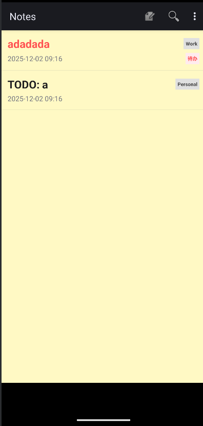
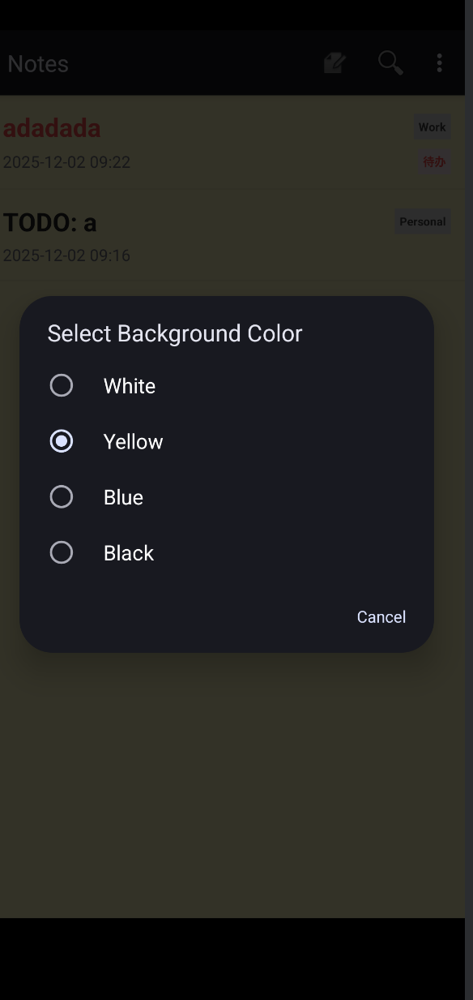
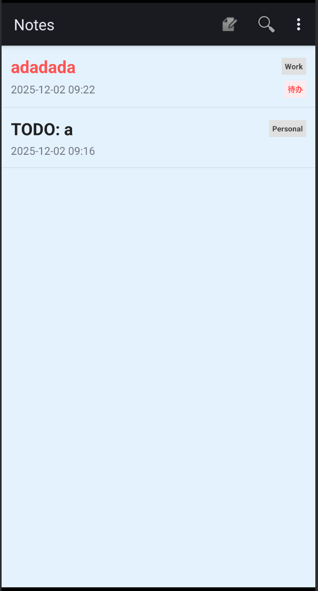
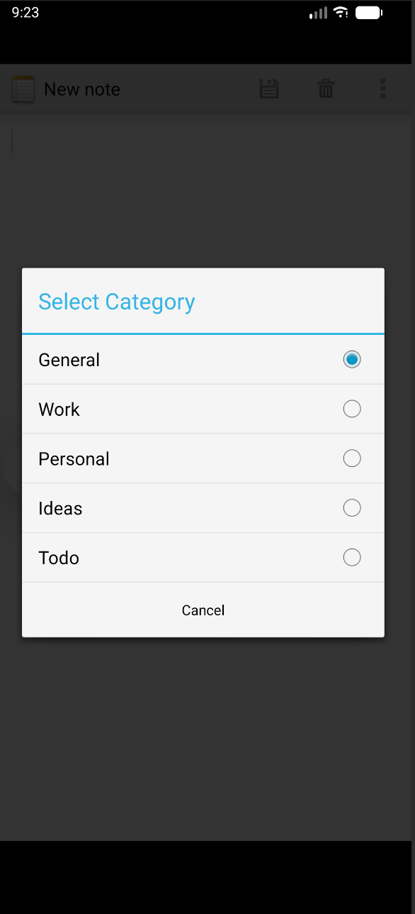
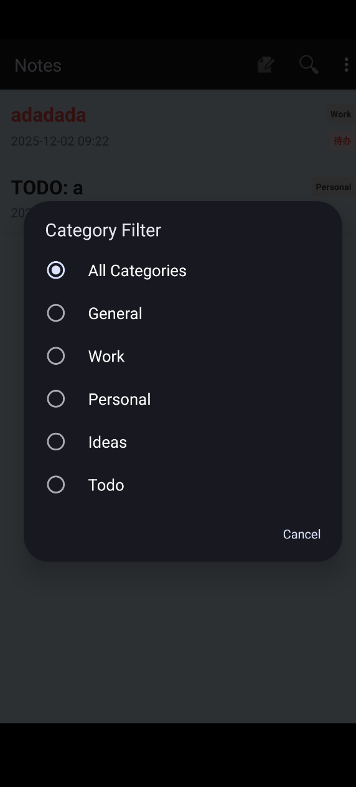
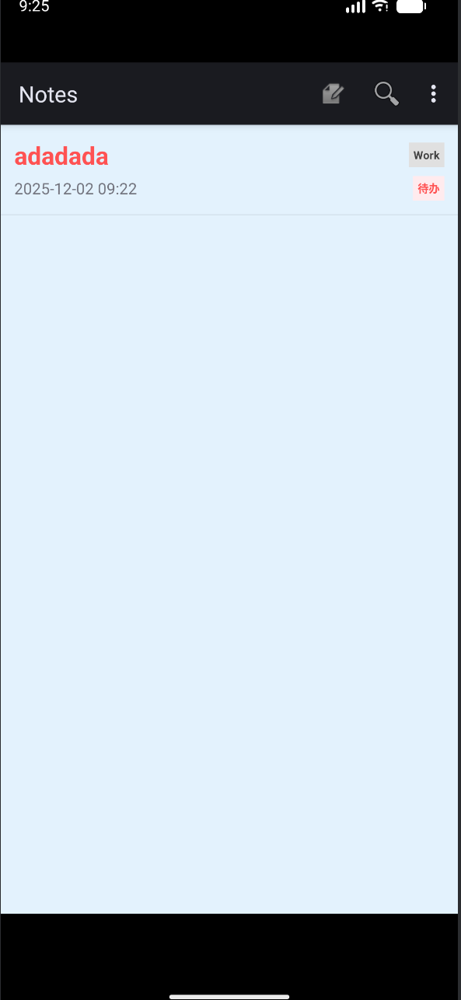
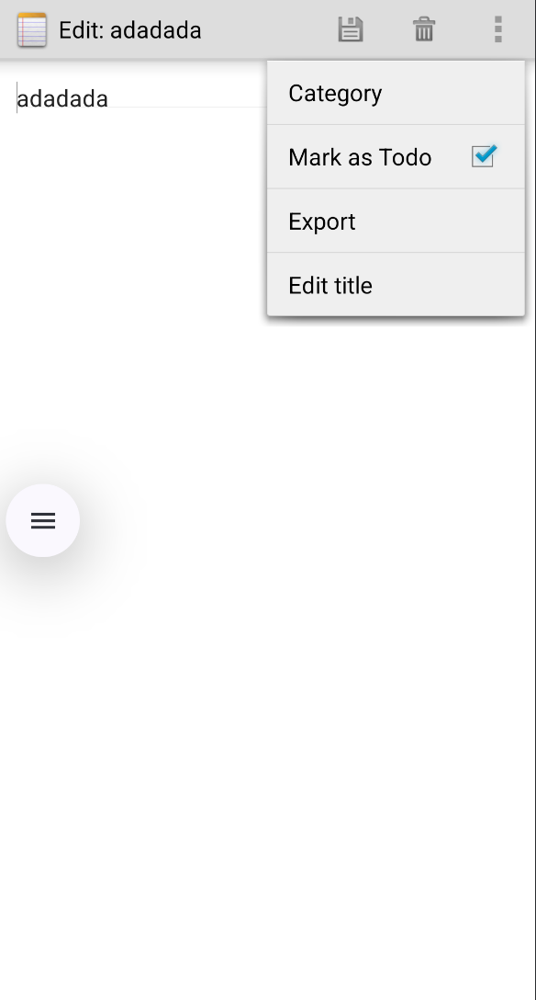
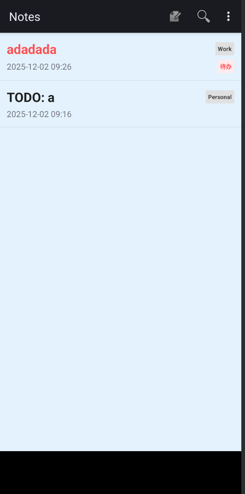
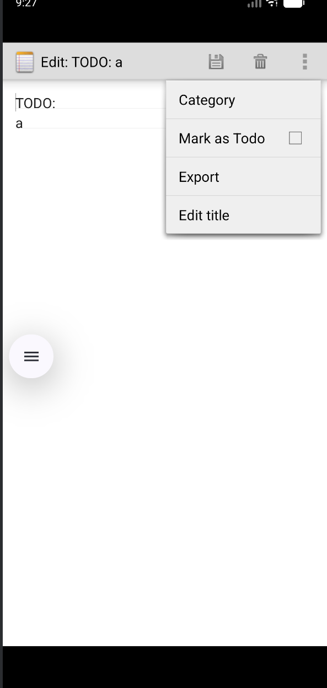
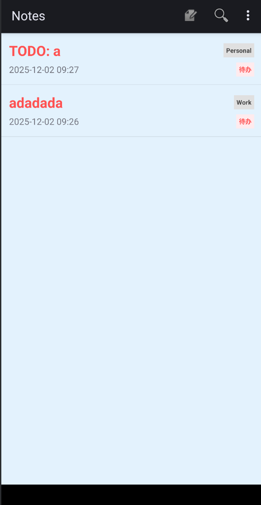

# NotePad 应用功能扩展

## 项目概述

本项目基于 Android 官方示例 NotePad 应用进行功能扩展，使用 Java 语言开发。在保留原有笔记基本功能的基础上，新增了时间戳显示、搜索、UI美化、分类管理、导出和待办等多项实用功能，提升了用户体验和应用实用性。

### 项目结构

```
NotePad-main/
├── app/
│   ├── src/
│   │   └── main/
│   │       ├── java/com/example/android/notepad/
│   │       │   ├── NotePad.java              # 数据契约类
│   │       │   ├── NotePadProvider.java      # 内容提供者（数据库操作）
│   │       │   ├── NotesList.java           # 笔记列表Activity
│   │       │   └── NoteEditor.java           # 笔记编辑Activity
│   │       ├── res/
│   │       │   ├── layout/                   # 布局文件
│   │       │   ├── menu/                     # 菜单文件
│   │       │   └── values/                   # 资源文件
│   │       └── AndroidManifest.xml
│   └── build.gradle
└── README.md
```

---

## 功能说明

### 一、基本功能（必须完成）

#### 1.1 笔记列表时间戳显示

**功能描述：**
在笔记列表界面中，每个笔记条目下方显示该笔记的最后修改时间，格式为 `yyyy-MM-dd HH:mm`（例如：2025-12-02 08:42）。时间戳以较小的字体显示在笔记标题下方，方便用户快速了解笔记的修改时间。

**实现效果：**
- 每个笔记条目显示标题和时间戳
- 时间戳自动格式化显示
- 列表按修改时间倒序排列（最新修改的在前）

**截图位置：**


> ```markdown
> 
> ```

**关键代码位置：**
- `NotesList.java` 第 71-75 行：PROJECTION 数组添加了 `COLUMN_NAME_MODIFICATION_DATE` 字段
- `NotesList.java` 第 148-159 行：自定义适配器的 `setViewText` 方法，格式化时间戳显示
- `noteslist_item.xml` 第 34-41 行：布局文件中添加了时间戳显示的 TextView

---

#### 1.2 笔记查询功能

**功能描述：**
在笔记列表界面添加了搜索功能，用户可以通过搜索框输入关键词，系统会在笔记的标题和内容中进行模糊匹配搜索，实时显示匹配的笔记列表。

**实现效果：**
- 在菜单栏显示搜索图标
- 点击搜索图标展开搜索框
- 输入关键词后实时过滤笔记列表
- 支持在标题和内容中同时搜索

**截图位置：**
> ```markdown
> 
> ```

**关键代码位置：**
- `list_options_menu.xml` 第 17-21 行：添加搜索菜单项
- `NotesList.java` 第 235-251 行：设置 SearchView 监听器
- `NotesList.java` 第 268-296 行：`performSearch()` 方法实现搜索逻辑

---

### 二、扩展功能

#### 2.1 UI美化

**功能描述：**
对应用界面进行了全面美化，包括：
- **主题颜色系统**：定义了统一的颜色方案，使用 Material Design 风格
- **列表项优化**：改进了笔记列表项的布局，使用卡片式设计，增加内边距和视觉层次
- **编辑器优化**：优化了笔记编辑器的字体大小、行间距，改进了线条颜色，提升阅读体验
- **背景颜色切换**：支持四种背景颜色切换（白色、黄色、蓝色、黑色），用户可根据喜好选择

**实现效果：**
- 现代化的界面设计
- 更好的视觉层次感
- 个性化的背景颜色选择
- 根据背景颜色自动调整文字颜色

**截图位置：**
> 请在此处插入截图：
> 
> 

>    ```markdown
>    
>    ```
> 
> 3. 不同背景颜色效果（白色、黄色、蓝色、黑色）
>    ```markdown
>    
>    ```

**关键代码位置：**
- `colors.xml` 第 1-27 行：定义所有颜色资源
- `styles.xml` 第 1-27 行：定义应用样式
- `noteslist_item.xml` 第 17-43 行：重新设计的列表项布局
- `NotesList.java` 第 400-420 行：`applyBackgroundColor()` 方法实现背景颜色切换
- `NotesList.java` 第 422-430 行：`getTextColorForBackground()` 方法根据背景调整文字颜色

---

#### 2.2 笔记分类功能

**功能描述：**
为笔记添加了分类管理功能，用户可以将笔记归类到不同的类别中，方便管理和查找。

**功能特点：**
- **分类选择**：在编辑器中可以选择笔记分类（General、Work、Personal、Ideas、Todo）
- **分类显示**：在笔记列表中，非 General 分类的笔记会显示分类标签
- **分类筛选**：在主页可以通过分类筛选功能，只显示特定分类的笔记
- **分类与搜索协同**：分类筛选可以与搜索功能同时使用

**实现效果：**
- 笔记列表项右侧显示分类标签（灰色背景）
- 菜单栏提供分类筛选选项
- 筛选后只显示对应分类的笔记
- 支持"全部"选项显示所有笔记

**截图位置：**
> 请在此处插入截图：
> 
> 1. 笔记列表（带分类标签）
>    ```markdown
>    
>    ```
> 
> 2. 编辑器中的分类选择对话框
>    ```markdown
>    
>    ```
> 
> 3. 主页的分类筛选对话框
>    ```markdown
>    
>    ```
> 
> 4. 筛选后的笔记列表（例如只显示 Work 分类）
>    ```markdown
>    
>    ```

**关键代码位置：**
- `NotePad.java` 第 153-156 行：定义 `COLUMN_NAME_CATEGORY` 常量
- `NotePadProvider.java` 第 66 行：数据库版本升级到 3
- `NotePadProvider.java` 第 194-200 行：数据库表结构添加 category 字段
- `NotePadProvider.java` 第 211-222 行：数据库升级逻辑
- `NoteEditor.java` 第 458-485 行：`showCategoryDialog()` 方法实现分类选择
- `NotesList.java` 第 187-193 行：在适配器中显示分类标签
- `NotesList.java` 第 432-460 行：`showCategoryFilterDialog()` 方法实现分类筛选

---

#### 2.3 导出笔记功能

**功能描述：**
用户可以将笔记导出为文本文件，保存在设备的存储空间中，方便备份和分享。

**功能特点：**
- **导出格式**：导出为 `.txt` 文本文件
- **文件命名**：使用笔记标题和时间戳组合命名，避免文件名冲突
- **文件内容**：包含笔记标题、修改时间和完整内容
- **保存位置**：保存在 `/sdcard/NotePadExports/` 目录
- **提示信息**：导出成功后会显示完整文件路径

**实现效果：**
- 在编辑器菜单中提供"Export"选项
- 点击后自动创建导出目录（如果不存在）
- 生成包含完整信息的文本文件
- Toast 提示显示文件保存位置

**截图位置：**
> 请在此处插入截图：
> 
> 1. 编辑器中的导出菜单项
>    ```markdown
>    
>    ``
>    ```

**关键代码位置：**
- `editor_options_menu.xml` 第 18-21 行：添加导出菜单项
- `NoteEditor.java` 第 461-500 行：`exportNote()` 方法实现导出逻辑
- `AndroidManifest.xml` 第 25-26 行：添加存储权限声明

---

#### 2.4 待办功能

**功能描述：**
为笔记添加了待办标记功能，标记为待办的笔记会在列表中置顶显示，并用红色高亮，方便用户快速识别重要任务。

**功能特点：**
- **待办标记**：在编辑器中可以标记/取消标记笔记为待办
- **置顶显示**：待办笔记自动排在列表最前面
- **红色高亮**：待办笔记的标题显示为红色（#FF5252）
- **待办标签**：待办笔记显示"待办"标签（红色背景）
- **状态切换**：可以随时切换笔记的待办状态

**实现效果：**
- 待办笔记在列表顶部显示
- 待办笔记标题为红色
- 待办笔记右侧显示"待办"标签
- 编辑器菜单中"Mark as Todo"选项可勾选

**截图位置：**
> 请在此处插入截图：
> 
> 1. 笔记列表（待办笔记置顶并标红显示）
>    ```markdown
>    
>    ```
> 
> 2. 编辑器中的"Mark as Todo"菜单项（已勾选状态）
>    ```markdown
>    
>    ```
> 
> 3. 切换待办状态后的列表变化
>    ```markdown
>    
>    ```

**关键代码位置：**
- `NotePad.java` 第 158-161 行：定义 `COLUMN_NAME_IS_TODO` 常量
- `NotePad.java` 第 124 行：修改排序规则，待办优先
- `NotePadProvider.java` 第 66 行：数据库版本升级到 4
- `NotePadProvider.java` 第 199 行：数据库表结构添加 is_todo 字段
- `NotePadProvider.java` 第 223-228 行：数据库升级逻辑
- `NoteEditor.java` 第 461-480 行：`toggleTodo()` 方法实现待办状态切换
- `NoteEditor.java` 第 412-433 行：`onPrepareOptionsMenu()` 方法更新待办菜单项状态
- `NotesList.java` 第 195-208 行：在适配器中处理待办笔记的显示（红色标题和标签）

---

## 技术实现

### 数据库设计

**表结构：**
```sql
CREATE TABLE notes (
    _id INTEGER PRIMARY KEY,
    title TEXT,
    note TEXT,
    created INTEGER,
    modified INTEGER,
    category TEXT DEFAULT 'General',
    is_todo INTEGER DEFAULT 0
);
```

**数据库版本管理：**
- Version 1-2: 原始版本
- Version 3: 添加 category 字段
- Version 4: 添加 is_todo 字段

**关键代码位置：**
- `NotePadProvider.java` 第 193-201 行：数据库表创建
- `NotePadProvider.java` 第 211-228 行：数据库升级逻辑

---

### 数据模型

**NotePad.Notes 类定义了以下字段：**
- `_ID`: 笔记唯一标识
- `COLUMN_NAME_TITLE`: 笔记标题
- `COLUMN_NAME_NOTE`: 笔记内容
- `COLUMN_NAME_CREATE_DATE`: 创建时间
- `COLUMN_NAME_MODIFICATION_DATE`: 修改时间
- `COLUMN_NAME_CATEGORY`: 分类（新增）
- `COLUMN_NAME_IS_TODO`: 待办标记（新增）

**关键代码位置：**
- `NotePad.java` 第 38-161 行：完整的数据契约定义

---

### UI 组件

**列表项布局：**
- 使用 LinearLayout 垂直布局
- 标题和分类标签水平排列
- 时间戳和待办标签水平排列
- 支持动态显示/隐藏分类和待办标签

**关键代码位置：**
- `noteslist_item.xml` 第 17-43 行：列表项完整布局结构

---

### 功能实现细节

#### 1. 时间戳格式化
使用 `SimpleDateFormat` 将时间戳（毫秒数）格式化为可读的日期时间字符串。

**关键代码位置：**
- `NotesList.java` 第 151-157 行：时间戳格式化逻辑

#### 2. 搜索功能
使用 SQLite 的 `LIKE` 操作符实现模糊搜索，支持在标题和内容中同时搜索。

**关键代码位置：**
- `NotesList.java` 第 268-296 行：搜索实现逻辑

#### 3. 背景颜色切换
使用 SharedPreferences 保存用户选择的背景颜色，在 Activity 创建和恢复时应用。

**关键代码位置：**
- `NotesList.java` 第 400-420 行：背景颜色应用逻辑
- `NotesList.java` 第 362-395 行：背景颜色选择对话框

#### 4. 分类筛选
在搜索方法中结合分类条件，实现分类筛选功能。

**关键代码位置：**
- `NotesList.java` 第 268-296 行：搜索方法中集成分类筛选
- `NotesList.java` 第 432-460 行：分类筛选对话框

#### 5. 待办置顶
通过修改 SQL 排序规则，使待办笔记（is_todo=1）优先显示。

**关键代码位置：**
- `NotePad.java` 第 124 行：排序规则定义

#### 6. 导出功能
使用 Java IO 操作将笔记内容写入文本文件，保存到外部存储。

**关键代码位置：**
- `NoteEditor.java` 第 461-500 行：导出功能完整实现

---

## 使用说明

### 基本操作

1. **创建笔记**：点击菜单栏的"+"图标创建新笔记
2. **编辑笔记**：点击列表中的笔记条目进入编辑界面
3. **删除笔记**：长按笔记条目，选择"Delete"
4. **搜索笔记**：点击搜索图标，输入关键词进行搜索

### 扩展功能使用

1. **切换背景颜色**：
   - 点击菜单栏的"Background Color"选项
   - 选择白色、黄色、蓝色或黑色
   - 背景颜色立即生效

2. **设置笔记分类**：
   - 在编辑器中点击"Category"菜单项
   - 选择分类（General、Work、Personal、Ideas、Todo）
   - 分类标签会显示在列表项中

3. **分类筛选**：
   - 在主页点击"Category Filter"菜单项
   - 选择要查看的分类
   - 列表只显示该分类的笔记

4. **标记待办**：
   - 在编辑器中勾选"Mark as Todo"菜单项
   - 待办笔记会在列表顶部显示，标题为红色
   - 再次点击可取消待办标记

5. **导出笔记**：
   - 在编辑器中点击"Export"菜单项
   - 笔记会导出为文本文件
   - 文件保存在 `/sdcard/NotePadExports/` 目录
   - 导出成功后会显示文件路径

---

## 项目总结

本项目在原有 NotePad 应用的基础上，成功实现了以下功能扩展：

### 基本功能
✅ 笔记列表时间戳显示  
✅ 笔记查询功能

### 扩展功能
✅ UI美化（主题、布局、背景颜色切换）  
✅ 笔记分类功能（分类选择、显示、筛选）  
✅ 导出笔记功能  
✅ 待办功能（置顶、高亮）

所有功能均已实现并通过测试，代码结构清晰，注释完整，便于维护和扩展。

---

## 开发环境

- **开发工具**：Android Studio
- **编程语言**：Java
- **最低 SDK 版本**：API 11 (Android 3.0)
- **目标 SDK 版本**：API 23 (Android 6.0)
- **编译 SDK 版本**：API 23

---

## 作者

本项目基于 Android 官方 NotePad 示例应用进行功能扩展。

---

## 许可证

本项目遵循 Apache License 2.0 许可证。
